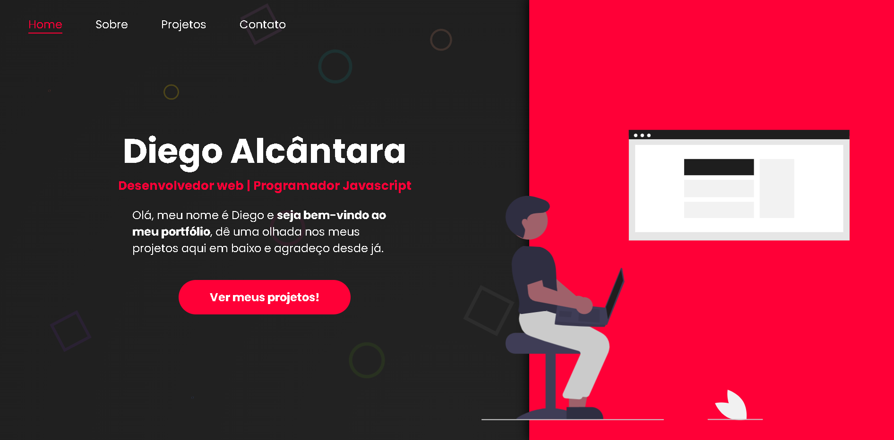
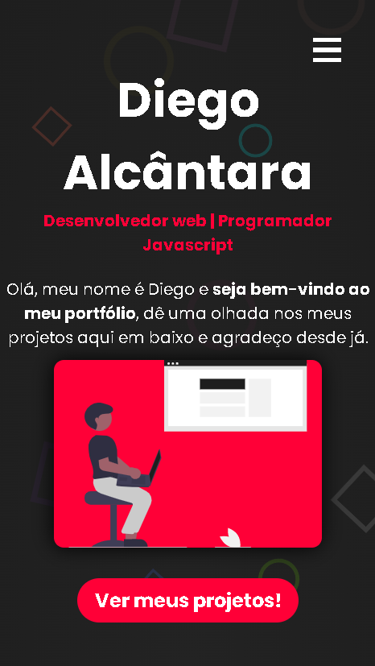
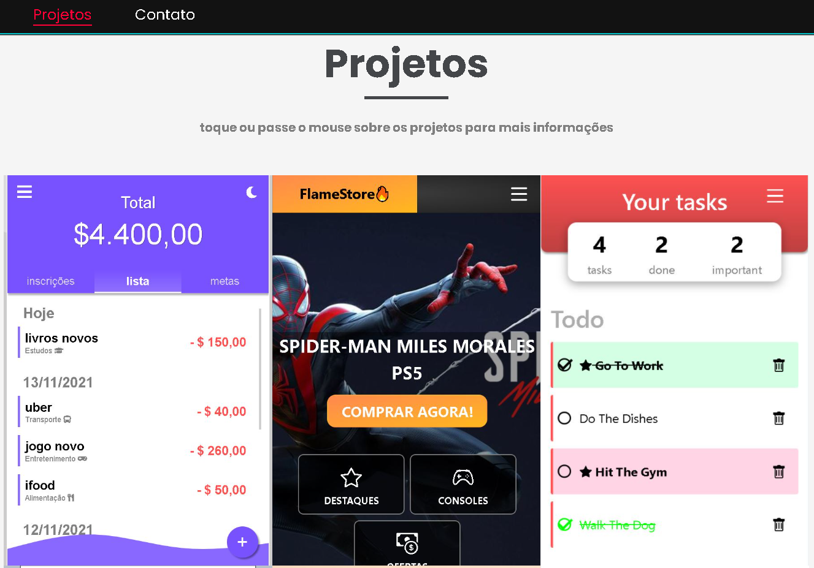

<h1 align="center">
    
</h1>

    

<h1 align="center">
    
</h1>

# Portfólio

<a align="center" style="font-weight: bold" href="https://alcantara-diego.github.io/portfolio/" target="_Blank">👉Acesse meu portfólio nesse link👈</a>

  

<h3>Tecnologias usadas no projeto</h3>
<ul>
<li>HTML5</li>
<li>CSS3</li>
<li>Javascript</li>
<li>JQuery</li>
</ul>

  
# Descrição

Meu portfólio com meus principais projetos já realizados, e hospedados no Github pages.

# Projetos apresentados:
 <strong>EXPENSE TRACKER</strong> (Aplicativo de gerenciamento de finanças).

 <strong>FIRESTORE</strong> (Front-End de uma loja de games digital feito em REACT, algumas funções ainda não estão funcionando pois o projeto ainda está em desenvolvimento, mas vale a pena dar uma olhada).

 <strong>TODOLIST</strong> (Aplicativo de gerenciamento de tarefas feito em REACT contendo diversas features).

 <strong>CONVERSOR DE MOEDAS</strong> (Informa quanto uma certa quantidade de reais vale em DÓLAR ou EURO, informações extraídas por API).

 <strong>CLIMATEMPO</strong> (Informa o clima de milhares de cidades disponíveis, informações extraídas da OpenWeather API).

 Ao tocar nos projetos em dispositivos móveis, ou passar o mouse por cima no desktop, é revelada uma div com o nome do projeto, tecnologias ultilizadas nele e um botão para saber mais, que ao clicado trará uma nova div contendo uma ilustração, rápida descrição do projeto e incluindo 2 links, o primeiro para testar o projeto, e o segundo link para ver o código no github.

   
 # Pré-requisitos:

 Nenhum pré-requisitos necessário, apenas te convido a dar uma olhada :)

 
<a align="center" style="font-weight: bold" href="https://alcantara-diego.github.io/portfolio/" target="_Blank">👉Acesse meu portfólio nesse link👈</a>

  

<strong>|Made with ❤️ by Diego Alcântara 👨🏽‍💻 <a align="center" style="font-weight: bold" href="https://www.linkedin.com/in/diego-alc%C3%A2ntara-790424235" target="_Blank">See my linkedIn</a></strong>

